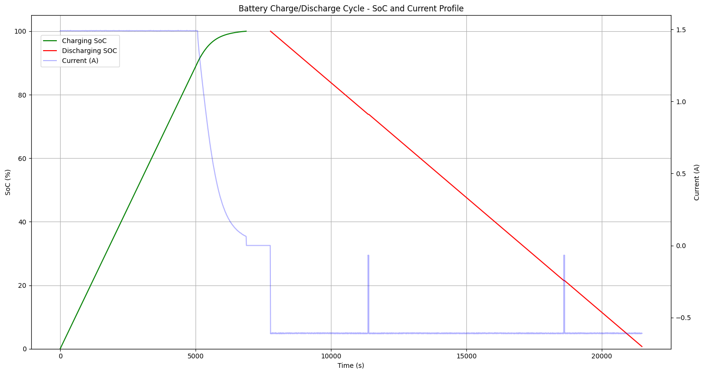

# battery-soc-estimation  

Battery State of Charge (SoC) Estimation and Visualization

This project performs **State of Charge (SoC) estimation** of a battery using real current-time data from an eVTOL battery dataset. The estimation is done by numerically integrating the current over time — a technique commonly referred to as **Coulomb Counting**.

The output is a combined plot showing:
- SoC during **charging** and **discharging** phases
- Corresponding **current profile** over time

---

## Output Plot

  
*Figure: SoC and Current Profile during Battery Charge/Discharge Cycle*

---

## 🔍 Plot Interpretation

- **Green Line (Charging SOC)**: The SOC begins at 0% and increases almost linearly during charging, reflecting a steady positive current (~1.5 A). The SOC reaches nearly 100%, indicating full charge.
- **Blue Line (Current)**: The current starts at a constant high value during charging. As charging ends, the current sharply drops. There are brief intervals of low or zero current before the current goes negative, signaling the start of discharge.
- **Red Line (Discharging SOC)**: After charging completes, SOC begins to decrease linearly, driven by a relatively constant negative current (~ -0.5 A). The SOC falls from 100% down to nearly 0% as the battery discharges.
- The sharp drop in current during the transition from charge to discharge, and the consistency of the current during both phases, illustrate a well-controlled test environment.

---

## 📊 What This Project Demonstrates

- How to estimate battery SOC from time-series current data using integration.
- How to detect charging vs discharging phases automatically based on current polarity.
- How to visualize dual-axis data (SOC and Current) for better interpretability.

---

## 🔗 Dataset Source

The current and voltage data used in this project is from Carnegie Mellon University's open-source eVTOL Battery Dataset:

📥 [eVTOL Battery Dataset on CMU Kilthub](https://kilthub.cmu.edu/articles/dataset/eVTOL_Battery_Dataset/14226830)

---

## 🙋 Author Notes

This notebook was developed and run in **VS Code** using a `.ipynb` file. It is a practical example of battery signal processing and numerical estimation, and a good portfolio piece for battery modeling or data science roles in the energy domain.

---
